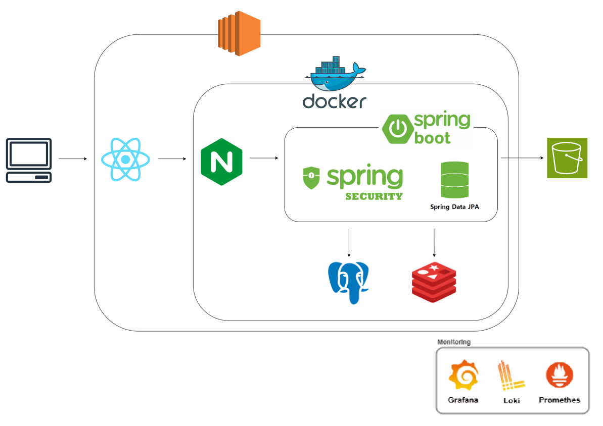
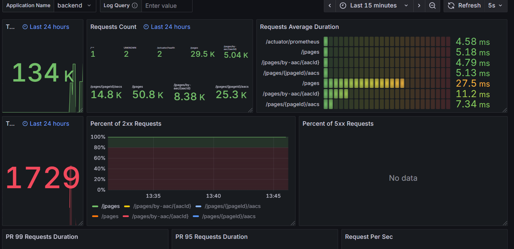
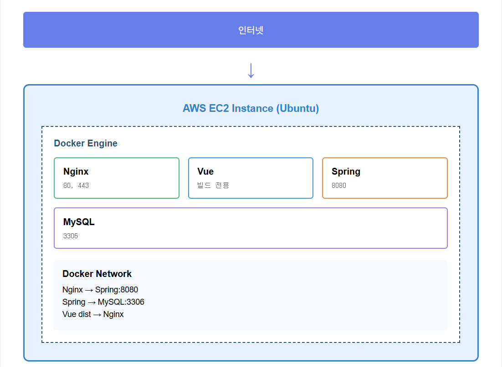

## 프로젝트 타임라인

2025.10-11 ━━ **Ongil**
Docker Swarm 클러스터 | Prometheus+Grafana+Loki | k6 부하테스트 | Jenkins+Sonarqube

2025.08-09 ━━ **Magic Bug**
모니터링 스택 첫 도입 | Nginx 최적화 (86% 개선)

2025.07-08 ━━ **Matching-SSAFY**
멀티 인스턴스 환경 | 분산 캐싱 (97% 개선) | Jenkins CI/CD

2025.05-06 ━━ **Hamgaja**
Docker | Nginx | GitHub Actions CI/CD

## 목차
1. [Ongil](#ongil)
2. [Magic Bug](#magic-bug)
3. [Matching-SSAFY](#matching-ssafy)
4. [Hamgaja](#hamgaja)

---
---

# Ongil

## 1. 프로젝트 개요
- **길잃음 방지와 AI 분석을 한 번에, 치매 어르신 케어 서비스**
- 경도인지장애를 겪고 계신 어르신들이 보호자와 좀 더 밀접하게 연결될 수 있도록 만든 안드로이드 어플리케이션입니다.
- 환자 본인의 길찾기, 보호자의 환자 길찾기 지정
- 보호자의 환자 위치 실시간 추적
- Voip를 통한 보호자와 환자 간의 전화
- 로그를 통한 환자 활동 분석

## 2. 시스템 아키텍처
  

- 도메인이 도메인인만큼 아키텍쳐를 설계할 때에도 고가용성, 그리고 단일실패점 최소화를 목표로 설계했습니다.
- 먼저 EC2 t3.large 서버 3개를 Docker Swarm으로 클러스터링 하여 사용했습니다. Raft 과반수 알고리즘을 위해 Manager 노드 3개로 구성하였고 서버 내에는 노드마다 Traefik을 두어 단일 진입점이 없도록 했습니다.
- Jenkins, Sonarqube 및 모니터링 스택들은 지급받은 별도의 EC2 t3.xlarge에 분리하여 인프라 스택이 어플리케이션과 자원을 경합하는 일이 없도록 구성했습니다.
- DB, Redis는 서버에 띄우는 대신 AWS의 서비스를 이용하여 DB가 다운되어 시스템 전체가 마비되는 치명적인 이슈가 일어나지 않도록 했습니다.
- Jenkins CI/CD 파이프라인에 Sonarqube를 통합하여 코드 품질을 관리하였고, Prometheus+Grafana+Loki의 조합으로 로그를 중앙화하고 서버의 상태를 실시간으로 파악할 수 있도록 했습니다.
- 이후 시그널링 메세지 유실 문제 해결, 재시도 로직을 통한 안정성 확보를 위해 RabbitMQ를 추가하여 안정성을 보강했습니다.

## 3. 주요 화면  

<table>
  <tr>
    <td width="33%" align="center">
       
      <b>환자 행동 분석</b>
    </td>
    <td width="33%" align="center">
       
      <b>환자 건강 분석</b>
    </td>
    <td width="33%" align="center">
       
      <b>환자 행동 통계</b>
    </td>
  </tr>
  <tr>
    <td width="33%" align="center">
       
      <b>환자 현재 위치</b>
    </td>
    <td width="33%" align="center">
       
      <b>AI 분석</b>
    </td>
    <td width="33%" align="center">
       
      <b>최근 통화 목록</b>
    </td>
  </tr>
</table>

## 4. 기술적 의사결정
### 4-1. Traefik 배치 문제
- 배경: 현재 EC2 노드가 3개가 있고 Traefik 컨테이너 하나로 로드밸런싱을 하는 중인데, 노드마다 Traefik을 배치하도록 리팩토링 할지 아니면 그대로 Traefik을 하나만 둘 지의 선택.
- 고민: Traefik이 하나 - SSL 등을 공유해야 할 필요가 없고, 관리가 용이함. 로그가 한 곳에만 찍히고 메모리도 Traefik 하나만큼만 차지함. 단 Traefik이 SPOF(Single Point Of Failure).  
노드마다 Traefik 배치 - SSL을 공유 볼륨 등을 통해 Traefik끼리 공유해야 함. 로그가 분산되고 메모리도 3배로 차지. 하지만 Traefik 하나가 다운되도 나머지가 동작.
- 선택: 유료 공유 볼륨을 사용하지 않더라도 Docker Secret으로 노드끼리 SSL 인증서를 공유할 수 있는 방법을 알아낸 점. 그리고 안정성이 중요한 도메인을 고려하여 노드마다 Traefik을 배치하도록 결정.  
- 결과: k6를 통한 부하테스트 도중 Traefik 컨테이너 하나를 kill 하자 일부의 실패는 있었지만 시스템이 계속 작동하고 이후 Traefik도 복구되는 것을 확인.

### 4-2. 서버 클러스터링 기술 선택
- 배경: EC2 3개를 사용하기로 했고, 자동 리커버리 등의 오케스트레이션 기능을 제공하고 여러 서버를 하나의 서버처럼 관리할 수 있는 등 여러 이점을 제공하기 때문에 
서버를 클러스터링해서 사용하기로 결정. 
- 고민: K8s - 업계 표준 기술. 정교한 스케일링, 배포, 리소스 관리 등 굉장히 강력하지만 러닝커브가 높고 서버 3대를 오케스트레이션 하는데 사용하기엔 다소 오버엔지니어링으로 느껴짐.
Docker Swarm - K8s에 비하면 기능적으로는 확실히 약하지만 기본적인 오케스트레이션 기능들을 모두 제공하고 기존 사용하던 Docker compose의 문법을 그대로 사용 가능하고 러닝커브가 낮음. 
- 선택: 한정된 프로젝트 일정을 감안했을 때 K8s를 지금 새로 배워서 적용하는 것에는 무리가 있다고 판단한 점, 그리고 서버 3대 규모에서 그렇게 정교한 오케스트레이션이 굳이 필요하지
않다고 느껴져 Docker Swarm을 채택.
- 결과: 이전에 사용하던 Docker compose에서 문법, 사용 방식이 크게 다르지 않아 빠르게 적응하고 서버를 클러스터링 하는데 성공. K8s를 사용했다면 이후의 일정에 크게 지장이 있었을 것.

## 5. 트러블슈팅
### 5-1. Traefik SSL 유실
- 문제: Traefik이 리팩토링 전 하나만 사용중일 때, 설정 변경이 있어 Traefik stack을 재시작했더니 SSL 인증이 작동하지 않는 문제.
- 원인: Docker의 named volume은 해당 노드의 로컬에 저장되는데, Traefik을 3개의 manager 노드 중 하나에 띄우게 설정하여 새로 띄워진 노드에는 SSL 인증서가 저장된 볼륨이 없었다.
- 해결: Traefik이 뜨는 노드를 private ip 하나로 고정한 후 재발급 받아 해결. 서버는 하나에서 3개로 늘었지만 신경써야 할 부분은 3배가 아닌 9배로 늘은 것 같다고 느꼈다.

### 5-2.시그널링 메세지 유실 문제
- 문제: Voip를 통해 전화를 걸 때 어떤 때에는 상대방에게 전화 신호가 가지만 어떤 때에는 상대방에게 전화 신호가 가지 않는 문제 
- 원인:
  

Spring의 SimpleBroker는 해당 노드 내에서 로컬로 작동하는데, 우리 프로젝트의 아키텍쳐에서는 서버를 3개를 사용하기 때문에 서로 다른 서버에 웹소켓이 연결되어 시그널링을 제대로 받을 수 없어 발생한 문제였다.
가끔 운이 좋아 같은 노드에서 웹소켓 통신이 연결됬을 땐 작동했던 것이다. 이런 분산 환경과 동시성 제어에 대한 경험이 많이 없어 발생했던 문제였다.
- 해결: RabbitMQ를 추가하여 모든 노드들이 메시지를 주고 받을 수 있도록 구현하여 해결.

### 5-3. Voip 문제
- 문제: 안드로이드 앱에서 전화를 연결하면 연결은 잘 되지만 음성이 전달되지 않는 문제
- 원인: 우리는 코드로 RabbitMQ 구독 -> OFFER 메세지 송신 과 같이 작성하지만 비동기 환경에서 실제로는 아직 RabbitMQ 구독이 끝나지 않음.
구독 이전에 보낸 메세지가 소실되어 발생한 문제.
- 해결: RabbitMQ가 제대로 구독될 때까지 약간의 Delay를 주어 해결. 안드로이드의 비동기 환경이 익숙치 않아 생긴 문제였다.

### 5-4. 커넥션 풀 병목 문제  
- 문제: 과부하 테스트 도중 RPS 500 시점에서 Sys load가 300%를 넘어 폭증하는 것을 확인. 서버 규모에 비해 최대 처리량이 낮은 문제.
- 원인: RDS의 CPU Utilization과 Data Connection을 확인해 본 결과 CPU는 22%로 낮은데 비해 Data Connection은 Hikari CP의 기본 제한인
  10*3=30개를 꽉 채운 것을 확인. 커넥션 풀 병목인 것으로 판단.
- 해결: 스프링에서 CP 제한을 30으로 늘린 결과 RPS 500 시점에서도 안정적으로 Sys load가 200 전후로 나오는 것을 확인.
- 참고 링크:  
**[[리커버리 부하테스트]](https://maize-snipe-6ab.notion.site/2b1834b8139180b6ba22c3f3b2ce59e4?pvs=74)**
**[[과부하 테스트 및 최적화]](https://maize-snipe-6ab.notion.site/2-2b2834b8139180508749c4d9c1c1acfe)**  

## 6. 회고
- 배운 점: 서버의 클러스터링과 분산 환경에서의 동시성 제어를 경험해볼 수 있었고, 지금까지 배운 기술들을 모두 활용해 고가용성의 아키텍쳐를 구축해볼 수 있었다.
- 아쉬운 점: 교육기관에서 프로젝트 시작 전 사용량을 미리 계산해서 제출한 후, 해당 금액 내에서 서버를 사용할 수 있는 구조이다. 원래 프로젝트 완성 후 부하테스트를 계속하며
문제를 찾고 개선하는 것을 반복해야 하는데, 그렇게 하지 못했다. MVP가 아슬아슬한 기한까지 안정화가 되지 않아 그 문제들을 해결하느라 프로젝트 기간을 모두 소모했고, 기간이 끝나자 이미 사용량이 아슬아슬해
 기본적인 테스트만 진행해볼 수 있었다.
- 개선 방향: 추후엔 Traefik이 하나 다운되도 일부의 실패도 나오지 않도록 Floating IP 등의 기법도 적용해보고 싶다.

---
---

# Magic Bug

## 1. 프로젝트 개요
- 발달이 느린 아이들을 위한 인터랙티브 동화책 플랫폼
- 아이들이 동화책을 읽을 때 정해진 페이지에서 나오는 아이콘대로 카메라 앞에서 행동하면 애니메이션이 나오며 페이지가 넘어가는 방식
- 발달이 느린 아이들의 경우 책을 읽고, 따라하는 과정에서 사회심리, 언어, 운동을 배운다는 여러 연구 결과들에 기반
- 팀원들이 미리 정해진 모션을 학습시킨 AI의 모션 인식에 기반하여 카메라 앞의 아이가 맞는 동작을 취했는지 판별하는 방식 

## 2. 시스템 아키텍처

- 아주 짧게 배정된 프로젝트 기한 속에서 기본적인 부분을 빠르게 구축하고 개발로 넘어가기 위한 설계
- 이전에 사용했던 기술인 Nginx, PostgreSQL을 추가하고 사용해본 경험이 있는 팀원이 있어 Redis를 추가.
- k6로 기본적인 부하테스트를 진행해보기 위해 모니터링 스택을 추가.

## 3. 주요 화면
<table>
  <tr>
    <td width="33%" align="center">
       
      <b>메인 화면</b>
    </td>
    <td width="33%" align="center">
       
      <b>내 서재</b>
    </td>
    <td width="33%" align="center">
       
      <b>도서 목록</b>
    </td>
  </tr>
  <tr>
    <td width="33%" align="center">
       
      <b>책 모달</b>
    </td>
    <td width="33%" align="center">
       
      <b>책 읽기</b>
    </td>
  </tr>
</table>

## 4. 성능 최적화
### Nginx 3D 모델 로딩 최적화
- 문제: 메인화면 오른쪽 아래의 3d 모델링이 뜰 때까지의 시간이 7초 가량으로 너무 늦게 뜨는 문제
- 해결: 기존에는 리버스 프록시, SSL 처리 용도로만 사용했던 Nginx가 원래는 정적 파일 서빙에 강점이 있다는 사실을 떠올려 Nginx 설정을
리팩토링 하기로 결정. sendfile+파일 디스크립터 캐싱+gzip 압축+브라우저 캐싱을 조합하여 Nginx 설정을 리팩토링했고 7초 가량이 걸리던 3d 모델 로딩이
1초 가량으로 크게 개선된 것을 확인.

## 5. 기술적 의사결정
### 6-1. ManytoMany vs Jsonb
- 배경: page 테이블과 aac 테이블이 현재는 many to many 관계로 연결되어있는데, 2중 Join을 거치는 것 보다 PostgreSQL의 강력한 Json 타입 지원을 활용할 수 없을까 해서 생긴 고민.
- 고민: manytomany 관계를 사용하면 2중 join을 하는 대신 aac 테이블의 수정이 용이하고, 중복 데이터가 생기지 않는다. 하지만 aac는 수정이 필요하지 않은 고정된 데이터인 점, 그리고
Jsonb 타입으로 처리해서 중복이 생겨도 크기가 크지 않은 점을 고려하면 Jsonb타입으로도 가능하지 않을까 싶은 생각이 들었다.
- 선택: 
  
2가지 방식을 사용하는 api를 모두 만들고 k6를 통해 부하테스트를 진행해본 결과 반정규화가 필요할 만큼 원래 방식의 속도도 크게 느리지 않은 점, 실시간성이 아주 중요한 서비스가 아닌 점,
그리고 차이가 생각보다 미미하여 반정규화의 오버헤드를 감수할 만큼의 이점을 보이지 않는다고 판단하여 기존의 ManytoMany 방식 유지. 
- 결과: 서비스는 기존 방식대로 잘 작동했고, 반정규화를 진행하면 기존의 데이터보다 결국 몇배가 늘어나게 되는 것인데 너무 섣부른 생각을 했던 것 같다.
Jsonb 타입을 이렇게 쓰는 것은 잘못 사용했던 것 같고, 추후의 프로젝트에서 복잡한 대쉬보드 집계 테이블을 만들 때 유용하게 잘 사용할 수 있었다.

## 6. 회고
- 배운 점: 모니터링 스택을 프로젝트에 적용하고 k6를 통해 부하테스트를 어떤 식으로 진행하는지, sleep을 어느정도로 적용해야 할지에 대해 배울 수 있었다.
- 아쉬운 점: 너무나도 짧은 프로젝트 기한 탓에 모니터링 스택을 적용하고 k6로 부하테스트를 진행하는 것 까지는 할 수 있었지만, 유의미한 가치를 뽑아내진 못했다.
첫째로는 프로젝트가 규모가 작아 대부분이 간단한 CRUD라 병목을 찾기가 여의치 않았고, 둘째로는 어떤 방식으로 테스트를 진행해야하는지 아직 잘 몰랐었다.
- 개선 방향: 스택은 적용했지만 제대로 테스트해보지 못했던 이 때의 경험을 발판삼아 이후 진행한 프로젝트에서는 과부하 테스트 등의 기법을 배워 서버가 얼마정도의 RPS까지 처리할 수 있는지, 병목이 어느 지점인지 찾아낼 수 있었다.

---
---

# Matching-SSAFY

## 1. 프로젝트 개요
- 기존 교육기관 내의 팀 매칭 과정에서의 비효율과 문제점을 개선한 팀 매칭 플랫폼
- 기존의 시스템에서는 관리자가 교육생들의 현재 팀 매칭 현황을 엑셀 시트의 raw 데이터로 파악해야 했음
- 이를 개선하기 위해 관리자가 현재 교육생들의 매칭 현황을 한 눈에 확인할 수 있는 대쉬보드 기능 제공, 포지션 별, 도메인 별, 전공 여부 기준으로 분류된 데이터로 인사이트를 제공
- 교육생에겐 교육생의 성향과 기술 스택 데이터를 Recsys가 종합적으로 분석하여 최적의 팀을 추천하고 자신의 프로필을 관리할 수 있는 기능을 제공

## 2. 시스템 아키텍처
  

Nginx를 통해 3개의 스프링 인스턴스를 로드밸런싱 하고, Hazelcast로 분산 캐싱, 분산 락을 구현함으로써 분산 환경을 구현했습니다.  
DB는 PostgreSQL을 사용했고 FastAPI로 만든 추천 시스템을 추가했습니다.

## 3. 주요 화면
<table>
  <tr>
    <td width="33%" align="center">
       
      <b>메인 화면</b>
    </td>
    <td width="33%" align="center">
       
      <b>관리자용 대시보드</b>
    </td>
    <td width="33%" align="center">
       
      <b>팀 생성 화면</b>
    </td>
  </tr>
  <tr>
    <td width="33%" align="center">
       
      <b>팀 페이지</b>
    </td>
    <td width="33%" align="center">
       
      <b>팀원 추천</b>
    </td>
  </tr>
</table>

## 4. 성능 최적화
### 대시보드 캐싱 (97% 개선)
- 문제 : 대쉬보드 기능은 통계를 내야 하기 때문에 쿼리의 양이 큰데 비해 사용자의 접근이 잦아 서버 부하가 커지는 문제.
- 해결 : Spring cache와 통합된 Hazelcast의 분산 캐싱을 통해 5분 단위의 캐시를 걸어 해결.
- 결과 : curl을 통해 테스트 결과 캐시 미스 시 1080ms 정도의 응답 시간이 캐시 히트 이후부턴 38ms 가량으로 획기적으로 감소.

## 5. 기술적 의사결정
### 5-1. Hazelcast vs Redis
- 문제 : 단일 서버에 Jenkins, Sonarqube, PostgreSQL 등 이미 많은 컨테이너가 올라가 있음에도 분산 캐싱 툴을 추가해야 하는 문제
- 고민 : 실무에서 많이 사용되는 기술이고 다양하고 강력한 기능을 제공하지만 서버에 추가로 띄워야 하는 Redis VS JVM 내부에 노드를 생성하는 구조로 작동하여 추가로 컨테이너를 띄우지 않아도 되지만 마이너하고 정보가 많이 없는 Hazelcast
- 선택 : 이번 프로젝트에서는 분산 환경을 처음으로 구성해봤기 때문에 운영 복잡도를 더 늘리고 싶지 않아 별도의 설정과 컨테이너, 러닝커브가 필요한 Redis 대신 Spring cache와 통합하여 라이브러리로 바로 사용이 가능한 Hazelcast로 결정. 프로젝트 규모가 조금 더 컸다면 좀 더 강력한 Redis를 선택했겠지만 현재 스프링 인스턴스가 3개 뿐이고 분산 캐싱, 분산 락 기능만이 필요한 점을 감안해서 결정.
- 결과 : 분산 캐싱, 분산 락이 테스트 결과 Hazelcast로도 인스턴스끼리 잘 작동하는 것을 확인(캐시 미스 시 1080ms → 캐시 히트 38ms (97% 개선)). 현재 서비스 규모가 크지 않고 그에 따라 캐시 규모도 크지 않아 JVM 내부의 힙 메모리를 사용하는 Hazelcast의 구조로도 무리 없이 잘 작동하는 것을 확인. 운영 복잡도 면에서 실질적인 오버헤드가 비슷하더라도 더 나은 선택이었다고 생각.

### 5-2. Jenkins vs GitHub Actions
- 문제 : 기존에 Github 플랫폼을 사용하며 Github Action을 통해 CI/CD 파이프라인을 구축했지만, 새 프로젝트가 Github가 아닌 Gitlab을 사용하게 되면서 사용이 불가능해진 문제
- 고민 : 새 CI/CD 툴로 기존의 Github Action과 사용법이 비슷해보이는 Gitlab runner VS 러닝커브가 조금 있지만 생태계가 강력하고 실무에서 자주 사용되는 Jenkins
- 선택 : 배우는 입장에서 했던 것을 또 하는 것보다는 러닝커브가 좀 있어도 실무에서 자주 사용되는 강력한 툴을 배우는 것이 장기적으로는 더 이득일 것이라 생각되어 Jenkins를 선택
- 결과 : gradle.yml 설정 하나만으로 끝내던 시절과 많은 것이 달라 파이프라인 구성에 시간이 좀 걸렸지만, Jenkins의 plugin을 사용해 CI/CD 파이프라인에 Sonarqube를 통합하여 더 퀄리티 있는 파이프라인을 구축하는데 성공

## 6. 회고
- 배운 점: 분산 환경에서는 각 서버간의 동기화, 동시성 제어가 굉장히 중요하다는 사실을 배울 수 있었다. 비전공자가 많은 팀에서 처음으로 팀장을 맡아
Git flow 전략, MR 및 커밋 컨벤션 도입, 인프라 추상화 등을 통해 협업을 체계화하고 팀원들이 맡은 기능에만 집중할 수 있도록 한 것은 잘한 부분이라고 생각.
- 아쉬운 점: 한 서버 내에서 이렇게 멀티 인스턴스로 분산 환경을 구성하는 것은 사실 결국 한 서버의 리소스를 나눠 쓰는 것이기 때문에 완전한 분산 구조라고 할 수 없다.
스프링 하나가 크래시나도 다른 컨테이너들이 동작한다는 이점은 있지만 역시 부족하다. 또한 팀원들이 Git 사용에 익숙치 않아 충돌과 코드 유실이 잦았다. Revert 등을 먼저 금지했어야 했던 것 같다.
- 개선 방향: 이후의 프로젝트에서는 기회가 있다면 실제로 분리된 EC2 서버들로 분산 환경을 구성해보고 싶다.
---
---

# Hamgaja

## 1. 프로젝트 개요
- 한국의 아름다운 관광지를 탐색하고 맞춤형 여행 계획을 세울 수 있는 웹 플랫폼
- 전국 17개 시도별 관광지를 레포츠, 숙박, 쇼핑 등 다양한 테마 별로 검색 가능
- AI 한줄팁으로 관광지와 관련된 요약 정보를 얻을 수 있음
- 게시판에서는 자신의 여행 경험과 팁을 공유 가능

## 2. 시스템 아키텍처
  

Docker를 사용해 EC2에 Nginx, Spring, Vue, MySQL 컨테이너를 띄워 배포했습니다. 

## 3. 주요 화면
<table>
  <tr>
    <td width="33%" align="center">
       
      <b>메인 화면</b>
    </td>
    <td width="33%" align="center">
       
      <b>관광지 검색</b>
    </td>
    <td width="33%" align="center">
       
      <b>여행계획 페이지</b>
    </td>
  </tr>
  <tr>
    <td width="33%" align="center">
       
      <b>게시판 페이지</b>
    </td>
  </tr>
</table>

## 4. 기술적 의사결정
### Docker, CI/CD 도입
- 문제: 통합 테스트를 하던 도중, 수정이 있을 때마다 매번 vite를 껐다 켜고 스프링도 껐다 켜는 과정에서 불편을 느낌. 배포를 할 때에도 jar 파일을
scp로 전송하는 과정이 불편하고 비효율적이었음.
- 고민: 평소에도 Docker, CI/CD에 관심이 있었지만 한정된 프로젝트 기한 내에 배워서 프로젝트에 적용해낼 수 있을지가 불명확했음.
- 선택: 컨테이너란 무엇인지, CI/CD가 어떤 방식인지 기본적인 부분을 공부하며 이대로 구현된다면 지금의 비효율을 안고 계속 개발하는 것보다 오히려 더
효율적일 수도 있겠다는 확신을 가짐.
- 결과: 성공적으로 구현이 완료되어 Docker Compose를 통해 한번에 백과 프론트를 재시작할 수 있었고, 개발 내용은 Github Action을 통해 즉시 서버에 배포되었음.
개발에도 속도가 붙어 기한 내에 프로젝트에서 계획했던 부분을 모두 완성해낼 수 있었음.

## 5. 회고
- 배운 점: 실무에서도 자주 사용되는 Docker, Nginx를 프로젝트에 적용해보며 왜 사용하는지, 어떤 이점이 있는지를 배울 수 있었다. 또한 잘 구성된 인프라는 인프라를 구성하는
노력보다도 더 큰 이득으로 돌아온다는 사실을 배울 수 있었다.
- 아쉬운 점: 팀원과 함께 만든 첫 프로젝트 치고는 잘 나왔다고 생각하지만, 역시 기능이나 규모 면에서 너무 작다고 느꼈다. 이번에 배운 내용을 활용해서 다음엔 더 규모있는 프로젝트를 해보고 싶다.
- 개선 방향: 지금 생각해보면 Nginx를 사용했지만 리버스 프록시 기능만 사용하고 SSL이나 정적 파일 서빙같은 기본적인 부분이 부족했던 것 같다. 

---
